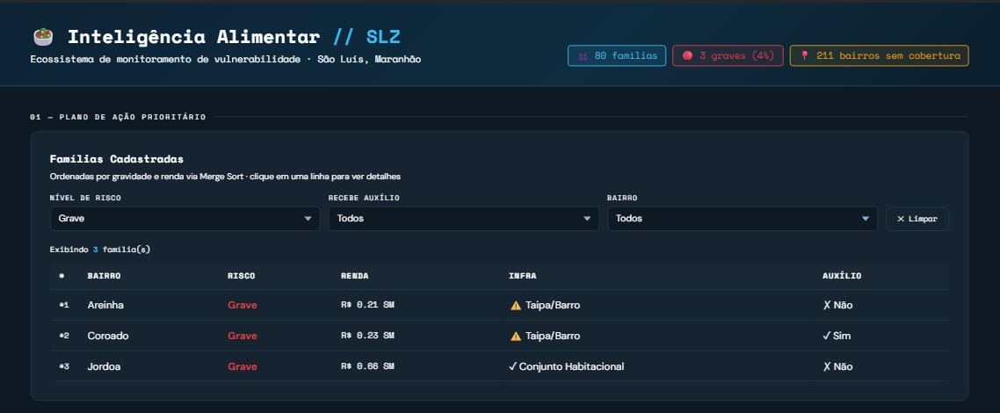
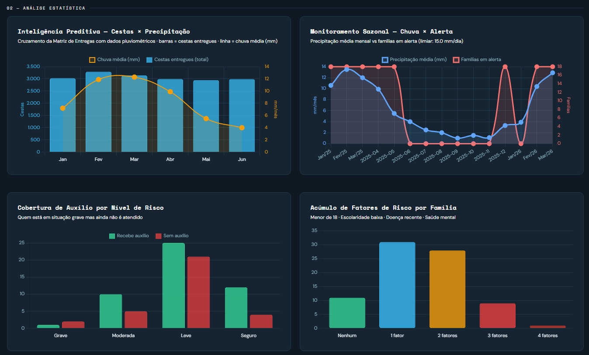
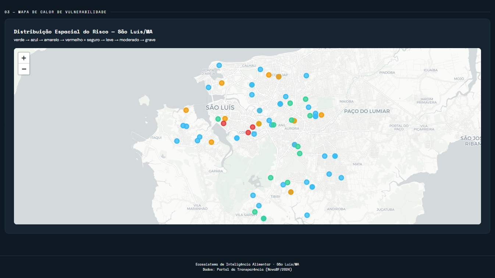

<h1 align="center">
    🥗 Ecossistema de Inteligência Alimentar — São Luís/MA
</h1>

<p align="center">
  
  
  
  
  
</p>

Plataforma de inteligência de dados desenvolvida para otimizar e apoiar a gestão de segurança alimentar em áreas de vulnerabilidade socioeconômica na capital maranhense, com foco estratégico em comunidades ribeirinhas e zonas de alto risco mapeadas.

## 📌 Visão Geral do Problema & Impacto
O sistema centraliza dados demográficos e automatiza a análise estratégica de risco, permitindo que a gestão pública e as secretarias municipais se antecipem a crises sazonais — como as severas enchentes que historicamente afetam São Luís no primeiro semestre. A ferramenta transforma dados brutos em inteligência geográfica para a tomada de decisões rápidas na distribuição de suprimentos emergenciais.

---

## 🛠️ Engenharia de Dados & Estruturas de Dados Customizadas

Para garantir a máxima performance, previsibilidade de tempo de execução e integridade no processamento dos dados, o projeto foi construído utilizando estruturas otimizadas para cada caso de uso:

| Estrutura / Algoritmo | Operação no Sistema | Justificativa Teórica & Complexidade |
| :--- | :--- | :--- |
| **Dicionários (Hash Maps)** | Cadastro e busca unificada de famílias por CPF/NIS | Permite acesso aos atributos de vulnerabilidade em complexidade de tempo constante **$O(1)$**. |
| **Conjuntos (Hash Sets)** | Monitoramento da cobertura territorial e auditoria | Operações de diferença de conjuntos para identificar instantaneamente bairros oficiais ainda desassistidos em **$O(1)$** por verificação. |
| **Merge Sort Customizado** | Algoritmo de ordenação estável para o ranking de prioridades | Garante a **estabilidade** dos dados (famílias com o mesmo risco mantêm a ordem relativa) com tempo previsível de **$O(n \log n)$** mesmo no pior caso. |
| **Matrizes (Listas Aninhadas)** | Cruzamento de dados geoespaciais e pluviométricos | Estrutura base para alimentar os mapas de calor e os gráficos de tendência temporal ($n$ bairros $\times$ $m$ meses) com complexidade de iteração de **$O(n \times m)$**. |

### O Critério de Ordenação Composto
A engine de priorização (implementada em `src/sorting.py`) adota dois níveis hierárquicos rígidos:
1. **Nível de Insegurança Alimentar (Peso Máximo):** `Grave (3)` > `Moderada (2)` > `Leve (1)` > `Seguro (0)`. Situações críticas são atendidas prioritariamente, independente de fatores financeiros.
2. **Renda Per Capita (Desempate):** Em caso de empate no nível de insegurança, o sistema prioriza a família com a menor renda per capita em salários mínimos (`renda_pc_sm`).

---

## 📊 Inteligência Visual (Dashboard Interativo)

O ecossistema integra dados socioeconômicos, indicadores de vulnerabilidade alimentar e informações pluviométricas para apoiar a tomada de decisão baseada em evidências. O resultado é um painel analítico interativo desenvolvido em HTML, CSS e JavaScript, que permite identificar famílias prioritárias, analisar fatores de risco e monitorar a distribuição espacial da vulnerabilidade em São Luís/MA.

### 📋 1. Plano de Ação Prioritário (Famílias Cadastradas)

O painel organiza automaticamente as famílias cadastradas por nível de risco, renda, infraestrutura habitacional e recebimento de auxílio social. Filtros dinâmicos permitem segmentar os registros por gravidade, cobertura de benefícios e bairro, facilitando a identificação de casos prioritários para intervenção.

<p align="center">
  
</p>

### 📊 2. Análise Estatística e Inteligência Preditiva

A seção analítica consolida indicadores estratégicos por meio de gráficos interativos. Entre eles estão a relação entre precipitação e distribuição de cestas, o monitoramento sazonal de alertas, a cobertura de auxílio por nível de risco e o acúmulo de fatores de vulnerabilidade por família. Essas visualizações permitem identificar padrões, antecipar cenários críticos e orientar ações preventivas.

<p align="center">
  
</p>

### 🗺️ 3. Mapa de Calor de Vulnerabilidade

Utilizando georreferenciamento com `Folium`, o sistema exibe a distribuição espacial das famílias monitoradas em São Luís/MA. Os marcadores são classificados por níveis de risco, utilizando uma escala visual que varia de seguro a grave. A visualização permite identificar concentrações de vulnerabilidade e apoiar a priorização territorial das ações assistenciais.

<p align="center">
  
</p>
---

## 📂 Arquitetura do Sistema

```text
/
├── /.vscode             # Configurações padronizadas do ambiente (Workspace)
├── /data                # Base de dados (JSON) e scripts simuladores / pipeline de ETL
│   ├── bairros_coords.json
│   ├── chuvas_slz.json
│   ├── familias_slz.json
│   └── [scripts de geração e classificação de dados...]
├── /docs                # Relatórios técnicos, benchmarks e documentação de suporte
│   └── relatorio.md     # Análise de complexidade e testes empíricos dos algoritmos
├── /src                 # Camadas de código-fonte (Arquitetura modularizada)
│   ├── logic.py         # Regras de negócio centrais e análise territorial
│   ├── sorting.py       # Implementação pura de algoritmos de ordenação (Merge Sort)
│   ├── structures.py    # Modelagem de dados e abstração de I/O
│   └── visuals.py       # Motor de integração gráfica (Folium e Chart.js)
├── main.py              # Script central de orquestração e execução do ecossistema
├── dashboard_slz.html   # Interface dashboard interativa gerada dinamicamente
└── requirements.txt     # Dependências estruturais do projeto

```

---

## 🚀 Como Executar o Projeto

### Pré-requisitos

Certifique-se de ter o **Python 3.10 ou superior** instalado na sua máquina.

### Passos para execução

1. **Acesse o repositório e faça o clone:**
   Você pode acessar a página do projeto em [github.com/cassia-nascimento/intel-alimentar-slz](https://github.com/cassia-nascimento/intel-alimentar-slz) ou clonar diretamente pelo terminal com o comando abaixo:

```bash
git clone https://github.com/cassia-nascimento/intel-alimentar-slz.git
cd intel-alimentar-slz

```

2. **Instale as dependências necessárias:**

```bash
pip install -r requirements.txt

```

3. **Execute o processamento e gere o Dashboard:**

```bash
python main.py

```

4. **Visualizar os Resultados:**
O script gerará um arquivo chamado `dashboard_slz.html` na raiz do projeto. Basta abrir esse arquivo diretamente em qualquer navegador web (Chrome, Edge, Firefox) para interagir com o mapa e os dados.

---

## 👩‍💻 Equipe de Desenvolvimento

Projeto acadêmico desenvolvido para a disciplina de **Estruturas de Dados** na **UNDB**.

* **Cássia Nascimento** — [GitHub](https://github.com/cassia-nascimento)
* **Leonardo Ferreira** — [GitHub](https://github.com/leonardoferrza)
* **Melissa Wolff** — [GitHub](https://github.com/melwolff13)
